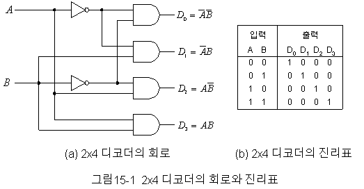

# 컴퓨터 시스템의 

## 컴퓨터의 정의

-컴퓨터(EDPS: Electronic Data Processing System)는 입력된 자료(Data)를 프로그램이라는 명령 순서에 따라 처리하여 그 결과를 살마이 알아볼 수 있도록 출력하는 전자 자료 처리 시스템이다.
-컴퓨터는 프로그램에 의해 자동으로 처리되므로, ADPS(Automatic Data Processing System)라고도 한다.

*자료
-관찰이나 측정을 통해 수집한 단순한 사실이나 결과값
-인간 또는 기계가 감지할 수 있도록 숫자, 문자, 기호 등을 이용하여 형식화한 것
* 정보(Information)
-의사 결정에 도움을 줄 수 있는 유용한 형태로, 자료를 가공(처리)한 것을 말한다.


## 컴퓨터의 특징

* 대용량성 
- 많은 양의 데이터를 처리 및 보관

* 범용성
- 컴퓨터를 여러 가지 용도로 사용

* 호환성
- 하나의 하드웨어나 소프트웨어를 컴퓨터의 기종에 관계없이 여러 컴퓨터에서 사용 가능

* 정확성
- 사용자의 요구 기능을 충족시키는 정도

* 신뢰성 
- 주어진 환경에서 고장 없이 담당 기능을 원활하게 수행하는 정도

■ (GIGO)
- 쓰레기(garbage)가 들어가면 쓰레기가 나온다는 의미
- 아무리 정확한 컴퓨터라도 '사람이 잘못된 자료를 입력하면 컴퓨터도 잘못된 결과를 출력한다'는 컴퓨터의 수동성을 뜻함


## 컴퓨터의 구성

컴퓨터 = 하드웨어 + 소프트웨어

* 하드웨어
- 하드웨어(hardware)는 딱딱한 제품이라는 의미
- 컴퓨터 시스템을 구성하는 물리적인 부품, 즉 기계적인 장치이다.

● 하드웨어는 중앙처리장치와 주변장치로 구성되고, 각각은 다음과 같이 구성

# 중앙처리장치 = 레지스터 + 제어장치 + 연산장치
# 주변장치 = 입·출력장치 + 보조기억장치 

* 소프트웨어 
- 소프트웨어(software)는 하드웨어의 반대 개념으로, 하드웨어를 사용하기 위한 각종 명령의 집합으로서 일반적으로 프로그램이라 부른다.

● 시스템 소프트웨어: 하드웨어 전체를 제어하고 운영
● 응용 소프트웨어: 특정 없무를 처리하기 위함
- 소프트웨어 = 시스템 소프트웨어 + 응용 소프트웨어

■ 펌웨어
- 펌웨어(Firmware)는 하드웨어의 동작을 지시하는 스프트웨어이지만 하드웨어적으로 구성되어 하드웨어의 일부분으로도 볼 수 있는 제품
- 주로 ROM에 반영구적으로 저장되어 하드웨어를 제어·관리하는 역할을 수행


## 중앙처리장치의 정의와 구성

중앙처리장치(CPU: Central Processing Unit)는 사람의 주뇌와 같이 컴퓨터 시스템에 부착된 모든 장치의 동작을 제어하고 명령을 실행하는 장치
중앙처리장치는 제어장치, 연산장치, 레지스터로 구성

◈ 제어장치
= 제어장치(Control Unit)는 컴퓨터에 있는 모든 장치들의 동작을 지시하고 제어하는 장치
- 제어장치는 명령 레지스터에서 읽어들인 명령어를 해독하여 해당하는 장치에세 제어 신호를 보내 정확하세 수행하도록 지시

- 제어장치는 프로그램 카운터(PC), 명령어 레지스터(IR), 부호기(제어신호 발생기), 명령어 해독기, 번지 해독기등으로 구성

- 명령어의 실행은 인출(Fetch) 단계, 간접(Indirect) 단계, 실행(Execute) 단계, 인터럽트(Interrupt) 단계를 거친다

■ 제어장치 명령 실행 순서
1) 프로그램 카운터에 저장된 주소(값)를 번지 레지스터에 옯긴다
2) 명령어를 주기억장치로부터 인출한다
3) 프로그램 카운터를 증가시킨다
4)명령 코드를 명령 레지스터로 옯긴다
5) 명령 레지스터의 내용을 해독하여 실행한다

◈ 연산장치
= 연산장치(ALU: Arithmetic & Logic Unit)는 제어장치의 명령에 따라 실제로 연산을 수행하는 장치
- 연산장치가 수행하는 연산에는 산술연산, 논리연산, 관계연산, 이동(Shift) 등이 있음
- 연산장치는 가산기, 누산기(AC: Accumulator), 보수기, 데이터 레지스터, 오버플로 검출기, 시프트 레지스터(Shift Register) 등으로 구성

◈ 레지스터
= 레지스터(Register)는 CPU 내부에서 처리할 명령어나 연산의 중간 결과값 등을 일시적으로 기억하는 임시 기억장소
- 레지스터는 메모리 중에서 속도가 가장 빠르다
- 레지스터에 새로운 데이터가 전송되면 기존에 있던 내용은 지워지고 새로운 내용만 기억된다
- 레지스터는 연산 속도를 향상시키기 위해 사용한다

★레지스터 종류

프로그램 카운터, 프로그램 계수기
(PC: Program Counter)         :               다음 번에 실행할 명령어의 번지를 기억하는 레지스터

명령 레지스터
(IR: Instruction Register)    :               현재 실행중인 명령의 내용을 기억하는 레지스터

누산기
(AC: Accumulator)             :               연산된 결과를 일시적으로 저장하는 레지스터로 연산의 중심이 됨

· 상태 레지스터(Status Register):              · 시스템 내부의 순간 순간의  상태가 기록된 정보를 PSW라고 함
· PSWR(Program Status Word Register):         · 오버플로, 언더플로, 자리올림, 인터럼트 등의 PSW를 저장하고 있는 레지스터
· 플래그 레지스터(Flag Register):              · 제어장치와 연산장치의 실행 순서를 제어하기 위해 사용되는 레지스터

메모리 주소 레지스터
(MAR: Memory Address Register):               기억장치를 출입하는 데이터의 번지를 기억하는 레지스터

메모리 버퍼 레지스터                           · 버퍼 레지스터라고도 함
(MBR: Memory buffer Register) :               · 기억장치를 출입하는 데이터가 잠시 기억되는 레지스터

인덱스 레지스터
(Index Register)              :               주소의 변경, 서브루틴 연결 및 프로그램에서의 반복 연산의 횟수를 세는 레지스터

데이터 레지스터
(Data Register)               :               연산에 사용될 데이터를 기억하는 레지스터

Shift Register                :               · 클럭 펄스(Clock Pulse)에 의해서 기억된 내용을 왼쪽 또는 오른쪽으로 1Bit씩 자리를 이동시키는 레지스터
                                              · 2배 길이 레지스터라고도 함
                                              
◈ 마이크로프로세서
= 마이크로프로세서(Microprocessor)는 제어장치, 연산장치, 레지스터가 하나의 대규모 집적회로 칩(IC)에 내장된 것으로, 개인용 컴퓨터(PC)에서 중앙처리장치로 사용되고 있음

- 마이크로프로세서는 설계 방식에 따라 RISC와 CISC로 구분
- RISC 방식은 명령어의 종류가 적어 전력 소비가 적고, 속도가 빠르지만 복잡한 연산을 수행하기 위해 명령어들을 반복·조합애서 사용해야 하므로 레지스터를 많이 필요로 하고, 프로그램도 복잡
- CISC 방식은 명령어의 종류가 많아 전력 소비가 많고 명령어 설계가 어려워 고가이지만 레지스터를 적게 사용하므로 프로그램이 간단하다
- 마이크로프로세서는 클럭 주파수와 내부 버스의 폭으로 선능을 

★ RISC와 CISC의 차이점
                    RISC                    CISC
명령어        |     적음             |       많음
명령어의 길이  |    고정             |        가변
실행 사이클    |    단일              |       다중
주소 지정      |    간단             |        복잡
레지스터       |    많음             |        적음
전력 소모      |     적음             |       많음
처리 속도      |     빠름             |       느림
프로그래밍     |     복잡함           |       간단함
용도          |     서버, 워크스테이션 |   개인용 컴퓨터(PC)


## 입·출력장치

= CPU로 처리해야 할 자료와 프로그램을 외부로부터 읽어 들여 컴퓨터로 처리할 수 있게 자료를 코드로 변환하여 주기억장치로 전달하는 장치(입력)
=처리된 데이터를 사람이 알아볼 수 있는 형태로 변환하여 표시하는 장치(출력)

◈ 입력장치
＊키보드(keyboard)
컴퓨텨의 가장 기본적인 입력장치로 문자나 기호의 입력, 커서 이동 등의 작업에 사용

＊ 마우스(mouse)
볼(ball)의 회전이나 빛의 반사를 감지하는 센서로 마우스 포인터의 움직임을 인식하여 컴퓨터에 입력하는 장치

＊ 스캐너(Scanner)
그림이나 사진 등의 영상 정보에 빛을 쪼인 후 반사되는 빛의 차이를 감지하여 디지털 그래픽 정보로 변환해 주는 장치로, 이미지 리더(Image Reader)라고도 함

＊ 라이트 펜(Light Pen)
빛을 인식할 수 잇는 모니터의 특정 부분을 눌러 해당 점의 위치를 컴퓨터에 입력하는 장치로, 그림을 그리거나 메뉴를 선택할 때 사용

＊ 광학 마크 판독기(OMR)
컴퓨터용 수성 사인펜으로 표시한 OMR 카드에 빛(Optical)을 비추어 표시 여뷰를 판독(Reader)하는 장치로, 객관식 시험용 답안지 채점에 사용

＊ 광학 문자 판독기(OCR)
특정 글꼴로 인쇄된 문자(Character)에 빛을 비추어 반사된 빛의 차이를 이용하여 문자를 판독하는 장치로, 세금고지서나 공공요금 청구서를 판독할 때 사용

＊ 자기 잉크 문자 판독기(MICR)
자성을 띤 특수 잉크(Magnetic Ink)로 인쇄된 문자나 기호를 판독하는 장치로 수표나 어음의 판독에 사용

＊ 바코드 판독기(BCR)
굵기가 서로 다른 선(BarCode)에 빛을 비추어 반사된 값을 코드화하여 판독하는 장치

◈ 출력장치

＊ 모니터(Monitor)
입력한 내용이나 컴퓨터 내부에서 처리된 결과를 사람이 확인 할 수 있도록 보여주는 장치

＊ 프린터(Print)
컴퓨터로 만든 결과물을 종이에 출력해 주는 장치로 잉크젯프린터, 레이저 프린터 등이 있음

＊ 플로터(Plotter)
용지의 크기에 제한 없이 고해상도 출력이 가능한 인쇄장치

◈ 보조기억장치
= 보조기억장치는 주기억장치의 단점을 보완하기 위한 장치로 주기억장치보다 속도는 느리지만 용량이 큼

· 보조기억장치는 입·출력 겸용 장치
· 종류에는 자기 디스크, 자기 테이프, CD-ROM, 하드디스크 등이 있음


# 컴퓨터의 발전 과정

1. 컴퓨터의 기원 
컴퓨터의 발전 과정

기종              개발 연도     개발자               의의
파스칼의 계산기|  1642    |   파스칼    |  덧셈, 뺼셈이 가능한 최초의 기계식 계산기
(Pascalline)  
해석기관       |  1834    |   바베지    |  현대 컴퓨터의 개념을 최초로 제시
천공카드 시스템|  1893    |   홀러리스  |   인구통계 및 국세 조사에 이용, 자동 계산의 실용성 확인
튜링기계       |  1937    |   튜링      |  추상적인 계산기의 모형으로서 컴퓨터의 논리적 모델이 됨
ABC            |  1942    | 아타나소프  |  최초의 진공관을 사용한 계산기
MARK-1         |  1944    |   에이컨    |  최초의 전기 기계식 자동 계산기
ENIAC          |  1946    |에커트 & 머큘리| 최초의 전자계산기
EDSAC          |  1949    |   윌키스    |  최초의 프로그램 내장 방식을 도입한 계산기
UNIVAC-1       |  1951    |  에커트 & 머큘리| 최초의 상업용 전자계산기(미 통계국에서 사용)
EDVAC          |  1952    |  폰 노이만  |   폰 노이만이 제작한 컴퓨터오 프로그램 내장 방식솨 2진법 채택

2. 컴퓨터의 세대별 특징
컴퓨터의 발저 세대별 주요 소자 및 특징

세대    |  논리소자     |   주기억장치  | 연산 속도 |           특징
제1세대 | 진공관        |   자기 드럼   | ms(10-³)  | 기계어 사용, 하드웨어 중심, 일괄 처리 시스템
제2세대 | 트랜지스터(TR)|   자기 코어   | ㎲(10-6)  | 고급언어 개발, 운영체제 도입, 온라인 실시간 처리, 다중 프로그램
제3세대 | 집적회로(IC)  |  집적회로(IC) | ns(10-9)  | · 시분할 처리, 다중 처리 · OCR, OMR, MICR, MIS 도입
제4세대 | 고밀도        |  고밀도       | ps(10-12) | · 개인용 컴퓨터 개발
          집적회로(LSI) |  집적회로(LSI)| ps(10-12) | · 마이크로프로세서 개발, 네트워크, 분산 처리
제5세대 | 초고밀도      |  초고밀도      | fs(10-15)| 인터넷, 인공지능, 처지 이론, 패턴 인식,
          집적회로(VLSI)|  집적회로(VLSI)|          | 전문가 시스템 등 신기술 개발
퍼지 이론: 불확실하고 애매한 자료를 컴퓨터에서 유용한 자료로 처리하기 위한 것
패턴 인식: 컴퓨터에서 그림, 음성 등의 정보를 읽어 들여 이미 기억된 정보와 비교·인식하는 방법
전문가 시스템: 전문 지식을 컴퓨터에 데이터베이스화하여 비전문가의 질문에 대한 댑을 컴퓨터가 제시하는 시스템

처리 속도 단위
         ms               ㎲             ns              ps              fs              as
단위 | 밀리초        | 마이크로초    | 나노초        | 피코초       |  펨토초       | 아토초
단위 | (Milli Second)| (Micro Second)| (Nano Second)| (Pico Second)| (Femto Second)| (Atto Second)
수치 | 10-3          |  10-9         | 10-12        |  10-15       |  10-18
속도 느림<----------------------------------------------------------------------------->속도 빠름

3. 컴퓨터의 분류
● 처리 능력에 따른 분류
· 슈퍼 컴퓨터(초대형 컴퓨터) : 초당 30~50테라플롭스(TFLops)의 속도로 연산을 수행하며 인공위성 제어, 일기예보, 시뮬레이션 처리 등의 특수 분야에 사용
· 메인 프레임(대형 컴퓨터) : 수백 명의 사용자가 동시에 사용할 수 있으며 은행, 병원, 정부기관 등에서 사용
· 미니 컴퓨터(중형 컴퓨터) : 중규모 시스템으로, 학교·연구소 등의 업무 처리나 과학 기술 계산에 사용
· 마이크로 컴퓨터(소형 컴퓨터) : '마이크로프로세서(MPU)'를 CPU(중앙 처리 장치)로 사용하는 컴퓨터이며, 네트워크에서 주로 클라이언트(Client)역할

마이크로 컴퓨터의 종류
워크스테이션(Workstation)
· 대부분 RISC 프로세서를 사용하며, 네트워커에서 서버(Server)역할을 담당
· 고성능 그래픽 처리나 공확용 시뮬레이션에 주로 사용
데스크톱 컴퓨터(Desktop Computer)
· 책상에 놓고 사용할 수 있는 일반적인 개인용 컴퓨터를 말함
휴대용 컴퓨터
· 가볍고 크기가 작아 휴대가 가능한 개인용(Personal) 컴퓨터로 노트북, 랩톱, 팝톱 컴퓨터가 있음

- 서버(Server)/클라이언트(Client)
서버는 네트워커에서 자원을 제공하는 쪽이고, 클라이언트는 그 자원을 제공받는 쪽이다.
- RISC 프로세서
RISC 프로세서는 기억, 연산, 제어장치가 한 개의 반도체 칩에 내장된 마이크로프로세서(MPU)의 한 종류로, 마이크로프로세서의 다른 종류인 CISC에 비해 기능이 우수

● 데이터 취급에 따른 분류
컴퓨터를 데이터 취급에 따라 분류한다는 것은 컴퓨터에서 처리하는 데이터의 형태
(디지털형, 아날로그형, 혼합형)를 기준으로 분류하는 것을 말한다.

· 디지털 컴퓨터(Digital) : 문자나 숫자화된 비연속적인 데이터(디지털형)를 처리하는 컴퓨터로, 사회 각 분야에서 일반적으로 사용하는 컴퓨터
· 아날로그 컴퓨터(Analog) : 온도, 전류, 속도 등과 같이 연속적으로 변화하는 데이터*아날로그형)를 처리하기 위한 특수 목적용 컴퓨터
· 하이브리드 컴퓨터(Hybrid) : 디지털 컴퓨터와 아늘로그 컴퓨터의 장점을 혼합하여 만들 컴퓨터

구분      |  디지털 컴퓨터     |     아날로그 컴퓨터
입력 형태 | 숫자, 문자         |  전류, 전압, 온도, 속도
출력 형태 | 숫자, 문자         |  곡선, 그래프
연산 형식 | 산술, 논리 연산    |  미·적분 연산
연산 속도 | 느림               | 빠름
구성 회로 | 논리 회로          | 증폭회로
프로그래밍| 필요함             | 필요하지 않음
정밀도    | 필요한 한도까지 가능| 제한적임
기억 기능 | 있음               | 없음
적용성    | 범용               | 특수 목적용
가격      | 고가               | 저가

디지털형과 아날로그형
디지털형은 결과를 이산적(비연속적, 구분된)인 숫자나 문자로 조합하여 표시하는 것이고, 아날로그형은 연속적인 값으로 표시하는 것을 말한다.
ex) 시간이 숫자로 표시되는 시계는 디지털형, 시침·분침 등이 있는 일반 시계는 아날로그형이다
디지털 컴퓨터는 숫자나 문자를 사용하여 매우 정밀하게 표시하므로 고가, 여러가지 목적으로 사용할 수 있다는 정도만 기억하고, 아날로그 컴퓨터는 이와 대비되는 특징을 가지고 있음

● 사용 용도에 따른 컴퓨터의 분류
컴퓨터를 어떠한 목적으로 사용하느냐에 따라 범용 컴퓨터와 전용 컴퓨터로 분류

· 범용 컴퓨터: 여러 분야에서 다양한 용도로 사용하기 위해 제작된 컴퓨터로, 디지털 컴퓨터가 여기에 해당
· 전용 컴퓨터: 특수한 목적에만 사용하기 위해 제작된 컴퓨터로 자동 제어 스스템, 항공기술 등 산업용 제어 분야 등에 사용되며, 아날로그 컴퓨터가 여기에 해당


# 논리회로
## 불 대수

1. 불대수의 개요
- 불 대수는 하나의 명제가 참 또는 거짓인지를 판단하는데 이용하는 수학적인 방법으로 영국의 수학자 불에 의해 개발
- 디지털 컴퓨터는 팜과 거짓을 나타내는 1과0의 두가지 상태로만 처리하는 2진 논리회로로 구성되었으므로, 이러한 논리회로를 간략화하여 표현할 때 불 대수가 사용

2. 기본적인 논리함수
· AND: 입력 정보의 값이 모두 1일 때만 결과가 1이 된다. 입력되는 값이 A, B라면 A AND B 또는 A·B로 표현
· OR: 입력 정보의 값 중 1개라도 1이면 결과가 1이 된다. 입력되는 값이 A, B라면 A OR B 또는 A+B로 표현
· NOT: 입력되는 정보의 반대 값이 출력된다. 입력되는 값이 항상 1개이다. 입력되는 값이 A라면, NOT A 또는 A' 또는 A(위에ㅡ붙여야함)로 표현
   AND                 OR                   NOT
A B | A AND B    A B | A OR B        A | NOT A
0 0 |    0       0 0 |   0           0 |   1
0 1 |    0       0 1 |   1           1 |   0
1 0 |    0       1 0 |   1
1 1 |    1       1 1 |   1       

3. 불 대수의 기본 공식
· 멱등볍칙
  
  A+A=A                     A·A =A
 A에 입력되는 값이         A에 입력되는 값이
 그대로 결과가 되므로      그대로 결과가 되므로
 A+A=A                     A·A=A
  
·보수법칙
  A+-A=1                               A·-A = 0
 A에 입력되는 값에                    A에 입력되는 값에 관계없이
 관계없이 결과가 항상 1이 되므로      결과가 항상 0이 되므로
 A+-A = 1                              A·-A = 0

·항등법칙
A+0=A                           A+1=1
 A에 입력되는 값이              A에 입력되는 값에 
 그대로 결과가 되므로           관계없이 결과가 항상 1이 되므로
 A+0=A                          A+1=1

A·0=0                               A·1 = A 
 A에 입력되는 값에                 A에 입력되는 값이 
 관계없이 결과가 항상              그대로 결과가 되므로
 A·0 = 0                           A·1 = A

·드모르강 법칙
 A+-B = -A·-B, -A·-B = -A+-B
  - 교환법칙: A+B = B+A, A·B = B·A
  - 결합법칙: A+(B+C)=(A+B)+C, A·(B·C)=(A·B)·C
  - 분배법칙: A·(B+C)=A·B+A·C, A+B·C=(A+B)·(A+C)
4. 논리식의 간소화
 불 대수의 기본 공식을 이용하여 간소화한다.
 1) 합의 곱((A+B)(C+D))표현으로 변환한다.
 2) 공통 인수를 뽑아 묶는다.
 3) 멱등법칙, 보수법칙, 항등법칙 등의 기본 공식 형태로 유도하여 줄여 나간다.

## 논리게이트 

1. 논리게이트
 논리 게이트는 논리회로를 구성하는 
 기본적인 전자소자로, 0 또는1을 입력과 출력으로 사용

</img>

 AND 회로(X=A·B)          |         OR 회로(X=A+B)
  두 개의 입력 스위치가    |    둘 중 하나 이상의 입력
  ON(A=1, B=1)으로 되어있을|    스위치가 ON으로 되면
  때에만 불이 켜짐         |    불이 켜짐
 
2. 논리회로의 이해


## 조합논리회로 - 반가산기, 전가산기

1. 조합논리회로
 조합논리회로는 이전의 입력에는 관계없이 현재의 입력(0 또는 1)에 의해서만 출력이 결정되는 논리회로이다. 
이에 반해 순서논리회로는 외부로부터의 입력과 현재 상태에 따라 출력이 결정된다.

· 조합 논리회로는 기억 기능이 없다.
· 반가산기, 전가산기, 디코더, 인코더, 멀티플렉서, 디멀티플렉서 등이 있다.

●순서논리회로
- 순서논리회뢰의 종류에는 플립플롭, 레지스터, 카운터, RAM, CPU등이 있음 
- 순서논리회로는 Section 009에서 설명한다.

2. 반가산기(HA; Half Adder)
 반가산기는 아래 그림처럼 1Bit 짜리 2진수 2개를 덧셈한 합(S)과 자리올림수(C)를 구하는 조합논리회로이다.
```
  0      0      1        1         A
+ 0    + 1    + 0      + 1       + B
￣￣   ￣￣   ￣￣     ￣￣      ￣￣       ·S: 합
0 0    0 1    0 1      1 0       C S       ·C: 자리올림
```

진리표
 입력 A, B가 있을 때 출력으로 S(합)와 C(자리올림)가 있다.
```
A  B | S | C
0  0 | 0 | 0
0  1 | 1 | 0
1  0 | 1 | 0
1  1 | 0 | 1
```
논리식
C=A·B
S=-A·B+A·-B
=A+B

3. 전가산기(FA; Full Adder)
 전가산기는 뒷자리에서 올라온 자리올림수(C<sub>i</sub>)를 포함하여 
1Bit 크기의 2진수 3자리를 더하여 합(S<sub>i</sub>)과 자리올림수(C<sub>i+1</sub>)를 구하는 회로이다.
  
  진리표
입력으로 A, B 그리고 전 단계의 자리올림수 C<sub>i</sub>가
있을 때 출력으로 합 S와 자리올림수 C<sub>i+1</sub>가 있다.
```
  A  B  C(작은 i) | S | C(작은 i +1)
  0  0  0         | 0 | 0 
  0  0  1         | 1 | 0 
  0  1  0         | 1 | 0
  0  1  1         | 0 | 1
  1  0  0         | 1 | 0
  1  0  1         | 0 | 1
  1  1  0         | 0 | 1
  1  1  1         | 1 | 1
```
  논리식
S = (A+B)+C<sub>i</sub>
C<sub>i+1</sub> = (A+B)C<sub>i</sub> + AB

전가산기는 반가산기와 더불어 시험에 종종 출제되는 부분
전가산기는 2개의 반가산기와 1개의 OR Gate로 구성된다.

## 기타 조합논리회로

1) 디코더(Decoder)
·디코더는 n개의 입력선으로 입력된 값을 2<sup>n</sup>개의 출력선으로 번역하는 회로로, 
주로 AND 게이트로 구성됨
·2진 코드를 다른 코드로 바꿀 때 사용

회로
</img>

블록도
입력선n => n*2<sup>n</sup> => 출력선 2<sup>n</sup>

