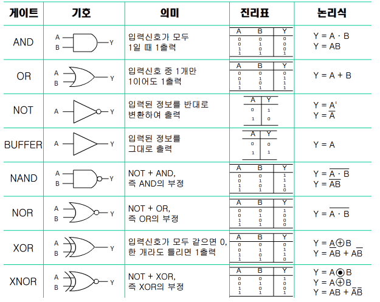

# 컴퓨터 시스템의 구성
keyword: 1.자료 2.정보  3.호환성  4.컴퓨터 세대별 특징 5.VLSI(초고밀도 집적회로)  6.디지털 컴퓨터  7.명령 레지스터(IR)  8.신뢰성  9.PSW  10.프로그램 카운터(PC)
## 컴퓨터의 정의

-컴퓨터(EDPS: Electronic Data Processing System)는 입력된 자료(Data)를 프로그램이라는 명령 순서에 따라 처리하여 그 결과를 살마이 알아볼 수 있도록 출력하는 전자 자료 처리 시스템이다.
-컴퓨터는 프로그램에 의해 자동으로 처리되므로, ADPS(Automatic Data Processing System)라고도 한다.

*자료
-관찰이나 측정을 통해 수집한 단순한 사실이나 결과값
-인간 또는 기계가 감지할 수 있도록 숫자, 문자, 기호 등을 이용하여 형식화한 것
* 정보(Information)
-의사 결정에 도움을 줄 수 있는 유용한 형태로, 자료를 가공(처리)한 것을 말한다.


## 컴퓨터의 특징

* 대용량성 
- 많은 양의 데이터를 처리 및 보관

* 범용성
- 컴퓨터를 여러 가지 용도로 사용

* 호환성
- 하나의 하드웨어나 소프트웨어를 컴퓨터의 기종에 관계없이 여러 컴퓨터에서 사용 가능

* 정확성
- 사용자의 요구 기능을 충족시키는 정도

* 신뢰성 
- 주어진 환경에서 고장 없이 담당 기능을 원활하게 수행하는 정도

■ (GIGO)
- 쓰레기(garbage)가 들어가면 쓰레기가 나온다는 의미
- 아무리 정확한 컴퓨터라도 '사람이 잘못된 자료를 입력하면 컴퓨터도 잘못된 결과를 출력한다'는 컴퓨터의 수동성을 뜻함


## 컴퓨터의 구성

컴퓨터 = 하드웨어 + 소프트웨어

* 하드웨어
- 하드웨어(hardware)는 딱딱한 제품이라는 의미
- 컴퓨터 시스템을 구성하는 물리적인 부품, 즉 기계적인 장치이다.

● 하드웨어는 중앙처리장치와 주변장치로 구성되고, 각각은 다음과 같이 구성

## 중앙처리장치 = 레지스터 + 제어장치 + 연산장치
## 주변장치 = 입·출력장치 + 보조기억장치 

* 소프트웨어 
- 소프트웨어(software)는 하드웨어의 반대 개념으로, 하드웨어를 사용하기 위한 각종 명령의 집합으로서 일반적으로 프로그램이라 부른다.

● 시스템 소프트웨어: 하드웨어 전체를 제어하고 운영
● 응용 소프트웨어: 특정 없무를 처리하기 위함
- 소프트웨어 = 시스템 소프트웨어 + 응용 소프트웨어

■ 펌웨어
- 펌웨어(Firmware)는 하드웨어의 동작을 지시하는 스프트웨어이지만 하드웨어적으로 구성되어 하드웨어의 일부분으로도 볼 수 있는 제품
- 주로 ROM에 반영구적으로 저장되어 하드웨어를 제어·관리하는 역할을 수행


## 중앙처리장치의 정의와 구성

중앙처리장치(CPU: Central Processing Unit)는 사람의 주뇌와 같이 컴퓨터 시스템에 부착된 모든 장치의 동작을 제어하고 명령을 실행하는 장치
중앙처리장치는 제어장치, 연산장치, 레지스터로 구성

◈ 제어장치
= 제어장치(Control Unit)는 컴퓨터에 있는 모든 장치들의 동작을 지시하고 제어하는 장치
- 제어장치는 명령 레지스터에서 읽어들인 명령어를 해독하여 해당하는 장치에세 제어 신호를 보내 정확하세 수행하도록 지시

- 제어장치는 프로그램 카운터(PC), 명령어 레지스터(IR), 부호기(제어신호 발생기), 명령어 해독기, 번지 해독기등으로 구성

- 명령어의 실행은 인출(Fetch) 단계, 간접(Indirect) 단계, 실행(Execute) 단계, 인터럽트(Interrupt) 단계를 거친다

■ 제어장치 명령 실행 순서
1) 프로그램 카운터에 저장된 주소(값)를 번지 레지스터에 옯긴다
2) 명령어를 주기억장치로부터 인출한다
3) 프로그램 카운터를 증가시킨다
4)명령 코드를 명령 레지스터로 옯긴다
5) 명령 레지스터의 내용을 해독하여 실행한다

◈ 연산장치
= 연산장치(ALU: Arithmetic & Logic Unit)는 제어장치의 명령에 따라 실제로 연산을 수행하는 장치
- 연산장치가 수행하는 연산에는 산술연산, 논리연산, 관계연산, 이동(Shift) 등이 있음
- 연산장치는 가산기, 누산기(AC: Accumulator), 보수기, 데이터 레지스터, 오버플로 검출기, 시프트 레지스터(Shift Register) 등으로 구성

◈ 레지스터
= 레지스터(Register)는 CPU 내부에서 처리할 명령어나 연산의 중간 결과값 등을 일시적으로 기억하는 임시 기억장소
- 레지스터는 메모리 중에서 속도가 가장 빠르다
- 레지스터에 새로운 데이터가 전송되면 기존에 있던 내용은 지워지고 새로운 내용만 기억된다
- 레지스터는 연산 속도를 향상시키기 위해 사용한다

★레지스터 종류
```
프로그램 카운터, 프로그램 계수기
(PC: Program Counter)         :               다음 번에 실행할 명령어의 번지를 기억하는 레지스터

명령 레지스터
(IR: Instruction Register)    :               현재 실행중인 명령의 내용을 기억하는 레지스터

누산기
(AC: Accumulator)             :               연산된 결과를 일시적으로 저장하는 레지스터로 연산의 중심이 됨

· 상태 레지스터(Status Register):              · 시스템 내부의 순간 순간의  상태가 기록된 정보를 PSW라고 함
· PSWR(Program Status Word Register):         · 오버플로, 언더플로, 자리올림, 인터럼트 등의 PSW를 저장하고 있는 레지스터
· 플래그 레지스터(Flag Register):              · 제어장치와 연산장치의 실행 순서를 제어하기 위해 사용되는 레지스터

메모리 주소 레지스터
(MAR: Memory Address Register):               기억장치를 출입하는 데이터의 번지를 기억하는 레지스터

메모리 버퍼 레지스터                           · 버퍼 레지스터라고도 함
(MBR: Memory buffer Register) :               · 기억장치를 출입하는 데이터가 잠시 기억되는 레지스터

인덱스 레지스터
(Index Register)              :               주소의 변경, 서브루틴 연결 및 프로그램에서의 반복 연산의 횟수를 세는 레지스터

데이터 레지스터
(Data Register)               :               연산에 사용될 데이터를 기억하는 레지스터

Shift Register                :               · 클럭 펄스(Clock Pulse)에 의해서 기억된 내용을 왼쪽 또는 오른쪽으로 1Bit씩 자리를 이동시키는 레지스터
                                              · 2배 길이 레지스터라고도 함
```                                              
◈ 마이크로프로세서
= 마이크로프로세서(Microprocessor)는 제어장치, 연산장치, 레지스터가 하나의 대규모 집적회로 칩(IC)에 내장된 것으로, 개인용 컴퓨터(PC)에서 중앙처리장치로 사용되고 있음

- 마이크로프로세서는 설계 방식에 따라 RISC와 CISC로 구분
- RISC 방식은 명령어의 종류가 적어 전력 소비가 적고, 속도가 빠르지만 복잡한 연산을 수행하기 위해 명령어들을 반복·조합애서 사용해야 하므로 레지스터를 많이 필요로 하고, 프로그램도 복잡
- CISC 방식은 명령어의 종류가 많아 전력 소비가 많고 명령어 설계가 어려워 고가이지만 레지스터를 적게 사용하므로 프로그램이 간단하다
- 마이크로프로세서는 클럭 주파수와 내부 버스의 폭으로 선능을 
```
★ RISC와 CISC의 차이점
                    RISC                    CISC
명령어        |     적음             |       많음
명령어의 길이  |    고정             |        가변
실행 사이클    |    단일              |       다중
주소 지정      |    간단             |        복잡
레지스터       |    많음             |        적음
전력 소모      |     적음             |       많음
처리 속도      |     빠름             |       느림
프로그래밍     |     복잡함           |       간단함
용도          |     서버, 워크스테이션 |   개인용 컴퓨터(PC)
```

## 입·출력장치

= CPU로 처리해야 할 자료와 프로그램을 외부로부터 읽어 들여 컴퓨터로 처리할 수 있게 자료를 코드로 변환하여 주기억장치로 전달하는 장치(입력)
=처리된 데이터를 사람이 알아볼 수 있는 형태로 변환하여 표시하는 장치(출력)

◈ 입력장치
＊키보드(keyboard)
컴퓨텨의 가장 기본적인 입력장치로 문자나 기호의 입력, 커서 이동 등의 작업에 사용

＊ 마우스(mouse)
볼(ball)의 회전이나 빛의 반사를 감지하는 센서로 마우스 포인터의 움직임을 인식하여 컴퓨터에 입력하는 장치

＊ 스캐너(Scanner)
그림이나 사진 등의 영상 정보에 빛을 쪼인 후 반사되는 빛의 차이를 감지하여 디지털 그래픽 정보로 변환해 주는 장치로, 이미지 리더(Image Reader)라고도 함

＊ 라이트 펜(Light Pen)
빛을 인식할 수 잇는 모니터의 특정 부분을 눌러 해당 점의 위치를 컴퓨터에 입력하는 장치로, 그림을 그리거나 메뉴를 선택할 때 사용

＊ 광학 마크 판독기(OMR)
컴퓨터용 수성 사인펜으로 표시한 OMR 카드에 빛(Optical)을 비추어 표시 여뷰를 판독(Reader)하는 장치로, 객관식 시험용 답안지 채점에 사용

＊ 광학 문자 판독기(OCR)
특정 글꼴로 인쇄된 문자(Character)에 빛을 비추어 반사된 빛의 차이를 이용하여 문자를 판독하는 장치로, 세금고지서나 공공요금 청구서를 판독할 때 사용

＊ 자기 잉크 문자 판독기(MICR)
자성을 띤 특수 잉크(Magnetic Ink)로 인쇄된 문자나 기호를 판독하는 장치로 수표나 어음의 판독에 사용

＊ 바코드 판독기(BCR)
굵기가 서로 다른 선(BarCode)에 빛을 비추어 반사된 값을 코드화하여 판독하는 장치

◈ 출력장치

＊ 모니터(Monitor)
입력한 내용이나 컴퓨터 내부에서 처리된 결과를 사람이 확인 할 수 있도록 보여주는 장치

＊ 프린터(Print)
컴퓨터로 만든 결과물을 종이에 출력해 주는 장치로 잉크젯프린터, 레이저 프린터 등이 있음

＊ 플로터(Plotter)
용지의 크기에 제한 없이 고해상도 출력이 가능한 인쇄장치

◈ 보조기억장치
= 보조기억장치는 주기억장치의 단점을 보완하기 위한 장치로 주기억장치보다 속도는 느리지만 용량이 큼

· 보조기억장치는 입·출력 겸용 장치
· 종류에는 자기 디스크, 자기 테이프, CD-ROM, 하드디스크 등이 있음


## 컴퓨터의 발전 과정

1. 컴퓨터의 기원 
```
컴퓨터의 발전 과정

기종              개발 연도     개발자               의의
파스칼의 계산기|  1642    |   파스칼    |  덧셈, 뺼셈이 가능한 최초의 기계식 계산기
(Pascalline)  
해석기관       |  1834    |   바베지    |  현대 컴퓨터의 개념을 최초로 제시
천공카드 시스템|  1893    |   홀러리스  |   인구통계 및 국세 조사에 이용, 자동 계산의 실용성 확인
튜링기계       |  1937    |   튜링      |  추상적인 계산기의 모형으로서 컴퓨터의 논리적 모델이 됨
ABC            |  1942    | 아타나소프  |  최초의 진공관을 사용한 계산기
MARK-1         |  1944    |   에이컨    |  최초의 전기 기계식 자동 계산기
ENIAC          |  1946    |에커트 & 머큘리| 최초의 전자계산기
EDSAC          |  1949    |   윌키스    |  최초의 프로그램 내장 방식을 도입한 계산기
UNIVAC-1       |  1951    |  에커트 & 머큘리| 최초의 상업용 전자계산기(미 통계국에서 사용)
EDVAC          |  1952    |  폰 노이만  |   폰 노이만이 제작한 컴퓨터오 프로그램 내장 방식솨 2진법 채택
```
2. 컴퓨터의 세대별 특징
컴퓨터의 발저 세대별 주요 소자 및 특징
```
세대    |  논리소자     |   주기억장치  | 연산 속도 |           특징
제1세대 | 진공관        |   자기 드럼   | ms(10-³)  | 기계어 사용, 하드웨어 중심, 일괄 처리 시스템
제2세대 | 트랜지스터(TR)|   자기 코어   | ㎲(10-6)  | 고급언어 개발, 운영체제 도입, 온라인 실시간 처리, 다중 프로그램
제3세대 | 집적회로(IC)  |  집적회로(IC) | ns(10-9)  | · 시분할 처리, 다중 처리 · OCR, OMR, MICR, MIS 도입
제4세대 | 고밀도        |  고밀도       | ps(10-12) | · 개인용 컴퓨터 개발
          집적회로(LSI) |  집적회로(LSI)| ps(10-12) | · 마이크로프로세서 개발, 네트워크, 분산 처리
제5세대 | 초고밀도      |  초고밀도      | fs(10-15)| 인터넷, 인공지능, 처지 이론, 패턴 인식,
          집적회로(VLSI)|  집적회로(VLSI)|          | 전문가 시스템 등 신기술 개발
퍼지 이론: 불확실하고 애매한 자료를 컴퓨터에서 유용한 자료로 처리하기 위한 것
패턴 인식: 컴퓨터에서 그림, 음성 등의 정보를 읽어 들여 이미 기억된 정보와 비교·인식하는 방법
전문가 시스템: 전문 지식을 컴퓨터에 데이터베이스화하여 비전문가의 질문에 대한 댑을 컴퓨터가 제시하는 시스템

처리 속도 단위
         ms               ㎲             ns              ps              fs              as
단위 | 밀리초        | 마이크로초    | 나노초        | 피코초       |  펨토초       | 아토초
단위 | (Milli Second)| (Micro Second)| (Nano Second)| (Pico Second)| (Femto Second)| (Atto Second)
수치 | 10-3          |  10-9         | 10-12        |  10-15       |  10-18
속도 느림<----------------------------------------------------------------------------->속도 빠름
```
3. 컴퓨터의 분류
● 처리 능력에 따른 분류
· 슈퍼 컴퓨터(초대형 컴퓨터) : 초당 30~50테라플롭스(TFLops)의 속도로 연산을 수행하며 인공위성 제어, 일기예보, 시뮬레이션 처리 등의 특수 분야에 사용
· 메인 프레임(대형 컴퓨터) : 수백 명의 사용자가 동시에 사용할 수 있으며 은행, 병원, 정부기관 등에서 사용
· 미니 컴퓨터(중형 컴퓨터) : 중규모 시스템으로, 학교·연구소 등의 업무 처리나 과학 기술 계산에 사용
· 마이크로 컴퓨터(소형 컴퓨터) : '마이크로프로세서(MPU)'를 CPU(중앙 처리 장치)로 사용하는 컴퓨터이며, 네트워크에서 주로 클라이언트(Client)역할

마이크로 컴퓨터의 종류
워크스테이션(Workstation)
· 대부분 RISC 프로세서를 사용하며, 네트워커에서 서버(Server)역할을 담당
· 고성능 그래픽 처리나 공확용 시뮬레이션에 주로 사용
데스크톱 컴퓨터(Desktop Computer)
· 책상에 놓고 사용할 수 있는 일반적인 개인용 컴퓨터를 말함
휴대용 컴퓨터
· 가볍고 크기가 작아 휴대가 가능한 개인용(Personal) 컴퓨터로 노트북, 랩톱, 팝톱 컴퓨터가 있음

- 서버(Server)/클라이언트(Client)
서버는 네트워커에서 자원을 제공하는 쪽이고, 클라이언트는 그 자원을 제공받는 쪽이다.
- RISC 프로세서
RISC 프로세서는 기억, 연산, 제어장치가 한 개의 반도체 칩에 내장된 마이크로프로세서(MPU)의 한 종류로, 마이크로프로세서의 다른 종류인 CISC에 비해 기능이 우수

● 데이터 취급에 따른 분류
컴퓨터를 데이터 취급에 따라 분류한다는 것은 컴퓨터에서 처리하는 데이터의 형태
(디지털형, 아날로그형, 혼합형)를 기준으로 분류하는 것을 말한다.

· 디지털 컴퓨터(Digital) : 문자나 숫자화된 비연속적인 데이터(디지털형)를 처리하는 컴퓨터로, 사회 각 분야에서 일반적으로 사용하는 컴퓨터
· 아날로그 컴퓨터(Analog) : 온도, 전류, 속도 등과 같이 연속적으로 변화하는 데이터*아날로그형)를 처리하기 위한 특수 목적용 컴퓨터
· 하이브리드 컴퓨터(Hybrid) : 디지털 컴퓨터와 아늘로그 컴퓨터의 장점을 혼합하여 만들 컴퓨터
```
구분      |  디지털 컴퓨터     |     아날로그 컴퓨터
입력 형태 | 숫자, 문자         |  전류, 전압, 온도, 속도
출력 형태 | 숫자, 문자         |  곡선, 그래프
연산 형식 | 산술, 논리 연산    |  미·적분 연산
연산 속도 | 느림               | 빠름
구성 회로 | 논리 회로          | 증폭회로
프로그래밍| 필요함             | 필요하지 않음
정밀도    | 필요한 한도까지 가능| 제한적임
기억 기능 | 있음               | 없음
적용성    | 범용               | 특수 목적용
가격      | 고가               | 저가
```
디지털형과 아날로그형
디지털형은 결과를 이산적(비연속적, 구분된)인 숫자나 문자로 조합하여 표시하는 것이고, 아날로그형은 연속적인 값으로 표시하는 것을 말한다.
ex) 시간이 숫자로 표시되는 시계는 디지털형, 시침·분침 등이 있는 일반 시계는 아날로그형이다
디지털 컴퓨터는 숫자나 문자를 사용하여 매우 정밀하게 표시하므로 고가, 여러가지 목적으로 사용할 수 있다는 정도만 기억하고, 아날로그 컴퓨터는 이와 대비되는 특징을 가지고 있음

● 사용 용도에 따른 컴퓨터의 분류
컴퓨터를 어떠한 목적으로 사용하느냐에 따라 범용 컴퓨터와 전용 컴퓨터로 분류

· 범용 컴퓨터: 여러 분야에서 다양한 용도로 사용하기 위해 제작된 컴퓨터로, 디지털 컴퓨터가 여기에 해당
· 전용 컴퓨터: 특수한 목적에만 사용하기 위해 제작된 컴퓨터로 자동 제어 스스템, 항공기술 등 산업용 제어 분야 등에 사용되며, 아날로그 컴퓨터가 여기에 해당


# 논리회로
keyword: 1.불 대수  2.드모르강  3.논리식의 간소화  4.논리 게이트  5.반가산기  6.전가산기  7.플립플롭  8.RS플립플롭  9.JK플립플롭  10.T플립플롭
## 불 대수

1. 불대수의 개요
- 불 대수는 하나의 명제가 참 또는 거짓인지를 판단하는데 이용하는 수학적인 방법으로 영국의 수학자 불에 의해 개발
- 디지털 컴퓨터는 팜과 거짓을 나타내는 1과0의 두가지 상태로만 처리하는 2진 논리회로로 구성되었으므로, 이러한 논리회로를 간략화하여 표현할 때 불 대수가 사용

2. 기본적인 논리함수
· AND: 입력 정보의 값이 모두 1일 때만 결과가 1이 된다. 입력되는 값이 A, B라면 A AND B 또는 A·B로 표현
· OR: 입력 정보의 값 중 1개라도 1이면 결과가 1이 된다. 입력되는 값이 A, B라면 A OR B 또는 A+B로 표현
· NOT: 입력되는 정보의 반대 값이 출력된다. 입력되는 값이 항상 1개이다. 입력되는 값이 A라면, NOT A 또는 A' 또는 A(위에ㅡ붙여야함)로 표현
```
   AND               OR               NOT
A B | A AND B    A B | A OR B        A | NOT A
0 0 |    0       0 0 |   0           0 |   1
0 1 |    0       0 1 |   1           1 |   0
1 0 |    0       1 0 |   1
1 1 |    1       1 1 |   1       
```
3. 불 대수의 기본 공식
· 멱등볍칙
```  
  A+A=A                     A·A =A
 A에 입력되는 값이         A에 입력되는 값이
 그대로 결과가 되므로      그대로 결과가 되므로
 A+A=A                     A·A=A
  
·보수법칙
  A+-A=1                               A·-A = 0
 A에 입력되는 값에                    A에 입력되는 값에 관계없이
 관계없이 결과가 항상 1이 되므로      결과가 항상 0이 되므로
 A+-A = 1                              A·-A = 0

·항등법칙
A+0=A                           A+1=1
 A에 입력되는 값이              A에 입력되는 값에 
 그대로 결과가 되므로           관계없이 결과가 항상 1이 되므로
 A+0=A                          A+1=1

A·0=0                               A·1 = A 
 A에 입력되는 값에                 A에 입력되는 값이 
 관계없이 결과가 항상              그대로 결과가 되므로
 A·0 = 0                           A·1 = A
```
```
·드모르강 법칙
 A+-B = -A·-B, -A·-B = -A+-B
  - 교환법칙: A+B = B+A, A·B = B·A
  - 결합법칙: A+(B+C)=(A+B)+C, A·(B·C)=(A·B)·C
  - 분배법칙: A·(B+C)=A·B+A·C, A+B·C=(A+B)·(A+C)
```
4. 논리식의 간소화
 불 대수의 기본 공식을 이용하여 간소화한다.
 1) 합의 곱((A+B)(C+D))표현으로 변환한다.
 2) 공통 인수를 뽑아 묶는다.
 3) 멱등법칙, 보수법칙, 항등법칙 등의 기본 공식 형태로 유도하여 줄여 나간다.

## 논리게이트 

1. 논리게이트
 논리 게이트는 논리회로를 구성하는 
 기본적인 전자소자로, 0 또는1을 입력과 출력으로 사용

</img>
```
 AND 회로(X=A·B)          |         OR 회로(X=A+B)
  두 개의 입력 스위치가    |    둘 중 하나 이상의 입력
  ON(A=1, B=1)으로 되어있을|    스위치가 ON으로 되면
  때에만 불이 켜짐         |    불이 켜짐
```
2. 논리회로의 이해


## 조합논리회로 - 반가산기, 전가산기

1. 조합논리회로
 조합논리회로는 이전의 입력에는 관계없이 현재의 입력(0 또는 1)에 의해서만 출력이 결정되는 논리회로이다. 
이에 반해 순서논리회로는 외부로부터의 입력과 현재 상태에 따라 출력이 결정된다.

· 조합 논리회로는 기억 기능이 없다.
· 반가산기, 전가산기, 디코더, 인코더, 멀티플렉서, 디멀티플렉서 등이 있다.

●순서논리회로
- 순서논리회뢰의 종류에는 플립플롭, 레지스터, 카운터, RAM, CPU등이 있음 
- 순서논리회로는 Section 009에서 설명한다.

2. 반가산기(HA; Half Adder)
 반가산기는 아래 그림처럼 1Bit 짜리 2진수 2개를 덧셈한 합(S)과 자리올림수(C)를 구하는 조합논리회로이다.
```
  0      0      1        1         A
+ 0    + 1    + 0      + 1       + B
￣￣   ￣￣   ￣￣     ￣￣      ￣￣       ·S: 합
0 0    0 1    0 1      1 0       C S       ·C: 자리올림
```

진리표
 입력 A, B가 있을 때 출력으로 S(합)와 C(자리올림)가 있다.
```
A  B | S | C
0  0 | 0 | 0
0  1 | 1 | 0
1  0 | 1 | 0
1  1 | 0 | 1
```
논리식
C=A·B
S=-A·B+A·-B
=A+B

3. 전가산기(FA; Full Adder)
 전가산기는 뒷자리에서 올라온 자리올림수(C<sub>i</sub>)를 포함하여 
1Bit 크기의 2진수 3자리를 더하여 합(S<sub>i</sub>)과 자리올림수(C<sub>i+1</sub>)를 구하는 회로이다.
  
  진리표
입력으로 A, B 그리고 전 단계의 자리올림수 C<sub>i</sub>가
있을 때 출력으로 합 S와 자리올림수 C<sub>i+1</sub>가 있다.
```
  A  B  C(작은 i) | S | C(작은 i +1)
  0  0  0         | 0 | 0 
  0  0  1         | 1 | 0 
  0  1  0         | 1 | 0
  0  1  1         | 0 | 1
  1  0  0         | 1 | 0
  1  0  1         | 0 | 1
  1  1  0         | 0 | 1
  1  1  1         | 1 | 1
```
  논리식
S = (A+B)+C<sub>i</sub>
C<sub>i+1</sub> = (A+B)C<sub>i</sub> + AB

전가산기는 반가산기와 더불어 시험에 종종 출제되는 부분
전가산기는 2개의 반가산기와 1개의 OR Gate로 구성된다.

## 기타 조합논리회로

1. 디코더(Decoder)
·디코더는 n개의 입력선으로 입력된 값을 2<sup>n</sup>개의 출력선으로 번역하는 회로로, 
주로 AND 게이트로 구성됨
·2진 코드를 다른 코드로 바꿀 때 사용

회로
</img>


블록도
입력선n => n*2<sup>n</sup> => 출력선 2<sup>n</sup>

2. 인코더(Encoder)
·인코더는 디코더의 반대 기능을 함
·2<sup>n</sup>개의 입력선으로 입력된 값을 n개의 출력선으로 코드화해서 출력하는 회로
·특정 값을 여러 자리인 2진수로 변환하거나 특정 장치로부터 보내오는 신호를 여러 개의 2진 신호로 바꾸어 변환시키는 장치
·특정한 장치에서 사용되는 정보를 다른 곳으로 전송하기 위하여 일정한 규칙에 따라 암호로 변환하는 장치

3. 멀티플렉서(MUX; Multiplexer)
멀티플렉서는 2<sup>n</sup>의 입력선 중 1개를 선택하여 그 선으로부터 입력되는 값을 1개의 출력선으로 출력시키는 회로

4. 디멀티플렉서(DeMUX; DeMultiplexer)
디멀티플렉서는 1개의 입력선으로 들어오는 정보를 2<sup>n</sup>개의 출력선 중 1개를 선택하여 출력하는 회로

- 디코더
3Bit를 코드화하려면 2<sup>3</sup>이므로 8개의 출력선이 필요
- 인코더
8(= 2<sup>3</sup>)개의 입력선이 있으면 3개의 출력선이 필요
- 멀티플렉서
8(= 2<sup>3</sup>)개의 입력선이 있다면 그 중에서 1개를 선택하기 위해 3개의 선택선이 필요
- 디멀피플렉서
8(= 2<sup>3</sup>)개의 출력선이 있다면 그중에서 1개를 선택하기 위해 3개의 선택선이 필요

## 순서논리회로
1. 순서논리회로의 특징
·순서논리회로는 외부로부터의 입력과 현재 상태에 따라 출력이 결정되는 회로
·순서논리회로는 기억 기능이 있음
·순서논리회로는 플립플롭과 논리 게이트로 구성

</img>

2. 플립플롭(FF; Flip-Flop)의 특징
·플립플롭은 전원이 공급되고 있는 한, 상태의 변화를 위한 신호가 발생할 때까지 현재의 상태를 그대로 유지하는 논리회로
·플립플롭 1개가 1Bit를 저장할 수 있음
·기본적인 플립플롭은 2개의 NAND 또는 NOR 게이트를 이용하여 구성
</img>

·플립플롭의 종류: RS-FF, D-FF, JK-FF, T-FF

플립플롭은 1비트를 저장할 수 있는 능력이 있다는 것과 플립플롭의 종류에는 RS, D, JK, T 플립플롭이 있다는것을 기억

1) RS 플립플롭(Reset-Set FF)
RS 플립플롭은 플립플롭의 기본으로, S와 R선의 입력을 조절하여 임의의 Bit값을 그대로 유지시키거나, 
무조건 0 또는 1의 값을 기억시키기 위해 사용되는 플립플롭


특성표
</img>

회로
</img>

RS FF의 기능(특성표 설명)
·클럭 펄스(CP; Clock Pulse)가발생하고 S와 R선에 각각 0과 0이 입력되면 플립플롭에 기억되어 있던 원래의 상태값은 변하지 않고 Q(t)의 상태를 그대로 유지한다.(무)
·0과 1이 입력되면 원래 기억되어 있던 상태값과 상광없이 무조건 0의 상태로 만든다. 즉 리셋(Reset) 상태로 만든다(항상 0)
·1과 0이 입력되면 원래의 상태에 상관없이 무조건 1의 상태로 만든다. 즉 세트(Set)상태로 만든다(항상 1)
·S와 R선 모두 1이 입력되면 플립플롭은 동작라지 않는다.(불가)

```
S, R의 순서로 입력될때 암기
S  R | Q(t+1)   | 암기
0  0 | Q(t)     | 무(상태변화 없음)
0  1 | 0        | 공(항상 0)
1  0 | 1        | 일(항상 1)
1  1 | 동작 안됨| 불(불가)
JK플립플롭은 J와 K에 모두 1이 입력될 때 보수가 출력되는 것이 RS 플립플롭과 다름
즉 JK는 무·공·일·보 이다.
```

2) D 플립플롭

·D 플립플롭은 RS FF의 R선에 인버터(Inverter)를 추가하여 S선과 하나로 묶어 입력선을 하나만 구성한 플립플롭
·D 플립플롭은 입력하는 값을 그대로 저장하는 기능을 수행


특성표
</img>

회로
</img>

- D FF동작 원리
클럭 펄스가 발생할 때 입력선 D로 0이 입력되면 플립플롭에는 그전에 어떤 값이 기억되어 있든지 상관없이 무조건 0이 기억되고, 입력선 D로 1이 입력되면 무조건 1이 기억된다.

3) JK 플립플롭
·JK 플립플롭은 RS FF에서 S = R = 1일 때 동작되지 않는 결점을 보완한 플립플롭
·RS FF의 입력선 S와 R을 JK FF의 입력선 J와K로 사용
·다른 모든 플립플롭의 기능을 대용할 수 있으므로 응용 범위가 넓고 집적회로화 되어 있어 가장 널리 사용

특성표
```
J  K | Q(t+1) | 상태
0  0 | Q(t)   | 상태 변화 없음
0  1 | 0      | Reset
1  0 | 1      | Set
1  1 | -Q(t)  | 반전
```

회로
</img>

- JK FF 동작 원리
·RS FF에서 S선과 R선에 모두 1을 입력(SR = 11)하는 경우의 동작만 달라지고 나머지 경우는 RS FF와 동일한 기능을 함
·J = K = 1이면 우너래의 상태를 보수로 만든다.

JK 플리플롭은 J와 K에 모두 1이 입력될 때 보수가 출력된다는 것과
다른 모든 플립플롭의 기능을 대용할 수 있으므로 응용 범위가 넓다는 것을 기억

4) T 플립플롭
·T 플립플롭은 JK FF의 두 입력선을 묶어서 1개의 입력선으로 구성한 플립플롭
·T = 0인 경우는 변화가 없고, T = 1인 경우에 현재의 상태를 토글(Toggle)시킨다.
즉 원 상태와 보수 상태의 2가지 상태로만 서로 전환된다.
· 누를 때마다 ON, OFF가 교차되는 스위치를 만들고자 할 때 사용되는 플립플롭
 
특성표
T  | Q(t+1) | 상태
0  | Q(t)   | 상태 변화 없음
1  | -Q(t)  | 반전

회로
</img>

- T FF의 동작 원리
클럭 펄스가 발생하여 FF를 동작시키고 입력선 T로 0을 입력하면 동작시키기 전에 기억되어 있던 상태 값이 그대로 유지되지만, 입력선 T로 1을 입력하면 원래의 상태를 보수로 만든다.

# 자료의 표현과 연산
keyword: 1.바이트  2.Full Word  3.2진수  4.8진수  5.16진수  6.1의 보수  7.EBCDIC  8.그레이 코드  9.해밍코드  10.2의 보수
## 자료 구성의 단위

자료 구성의 단위
```
비트                | ·자료(정보)표현의 최소 단위
(Bit, Binary Digit) | ·두 가지 상태(0과1)를 표시하는 2진수 1자리
---------------------------------------------------------------
니블                | ·4개의 비트(Bit)가 모여 1개의 니블을 구성
(Nibble)            | 4비트로 구성되며 16진수 1자리를 표현하기 적합
---------------------------------------------------------------
바이트              | ·문자를 표현하는 최소 단위로, 8개의 비트가 모여 1Byte를 구성
(Byte)              | ·1Byte는 256(2<sup>8)가지의 정보를 표현
                    | ·주소 지정의 단위로 사용
                    | ·일반적으로 영문자나 숫자는 1Byte로 한 글자를 표현하고, 한글, 한자는 2Byte로 한 글자를 표현
----------------------------------------------------------------
                    | ·CPU가 한 번에 처리할 수 있는 명령 단위
워드                | ·반워드(Half Word): 2Byte
(Word)              | ·전워드(Full Word): 4Byte
                    | ·더블워드(Double Word): 8Byte
---------------------------------------------------------------
필드                | ·파일 구성의 최소 단위
(Field)             | ·의미 있는 정보를 표현하는 최소 단위
---------------------------------------------------------------
레코드              | ·하나 이상의 관련된 필드가 모여서 구성
(Record)            | ·컴퓨터 내부의 자료 처리 단위로서 일반적으로 레코드는 논리 레코드(Logical Record)를 의미
---------------------------------------------------------------
블록                | ·하나 이상의 논리 레코드가 모여서 구성
(Block)             | ·각종 저장매체와의 입·출력 단위이며, 물리 레코드(Physical Record)라 함
---------------------------------------------------------------
파일(Flie)          | ·프로그램 구성의 기본 단위로, 여러 레코드가 모여서 구성
---------------------------------------------------------------
데이터베이스        | ·여러 개의 관련된 파일의 집합
(Database)          | ·관계형, 계층형, 망형 데이터베이스가 있음
```

비트
Bit는 Binary Digit의 합성어이다.
Binary는 2를 의미, Digit는 아라비아 숫자를 뜻하는 것으로 2진수를 말함

필드 
다른 말로 아이템(Item), 항목이라고도 함

자료 표현 단위 크기(작다<크다)
비트 < 니블 < 바이트 < 워드(반워드) < 전워드 < 더블워드 < 필드 < 레코드(논리 레코드<물리 레코드) < 파일 < 데이터베이스

- 자료 구성의 단위는 컴퓨터를 공부하는데 가장 기본적인 부분이라 함
- 자료의 구성에 따른 각 단위의 이름과 특성을 기억하고, 단위를 크기 순으로 나영할 수 있도록 알기

/ 비트의 표현 가짓수·자료의 구성/
```
비트  | 표현 가짓수 |               표현 숫자
1비트 | 2(1)=2가지  | 0, 1
2비트 | 2(2)=4가지  | 00, 01, 10, 11
3비트 | 2(3)=8가지  | 000, 001, 010, 011, 100, 101, 110, 111
4비트 | 2(4)=16가지 | 0000, 0001, 0010, 0011, 0100, 0101, 0110, 0111, 1000, 1001, 1010, 1011, 1100, 1101, 1110, 1111
：    |     ：      |                 ：
```
## 수의 표현 및 진법 변환

1. 진법의 개념 및 종류
·컴퓨터는 컴퓨터 내부에서 2진법을 사용하여 모든 연산을 수행
·2진수 외에 컴퓨터를 연구할 때 자주 사용하는 진법은 8진수와 16진수임

{8진수와 16진수}
컴퓨터의 내부 자료를 분석할 때 2진수로 숫자를 표현하면 단위가 길어져 수치의 크기를 가늠하기 어려워진다.
이 때 사용하는 진수가 8진수와 16진수이다
8진수 한 자리는 2진수 3자리에 대응하고, 16진수 한자리는 2진수 4자리에 해당하며, 바로 변환이 가능한다
예를 들어 10진수 255는 2진수로 표현하면 11111111이지만 8진수로 표현하면 377, 16진수로 표현하면 FF이다

·10진수, 2진수, 8진수, 16진수 비교표
</img>

2. 10진수를 2진수, 8진수, 16진수로 변환
·정수 부분: 10진수의 값을 변환할 진수로 나누어 더 이상 나눠지지 않을 때까지 나누고, 몫을 제외한 나머지를 역순으로 표시
·소수 부분: 10진수의 값에 변환할 진수를 곱한 후 결과의 정수 부분만을 차례대로 표기하되, 소수 부분이 0또는 반복되는 수가 나올 때까지 곱하기를 반복

각 진법간상호 변환 방법을 정확히 이해

3. 2진수, 8진수, 16진수를 10진수로 변환
정수 부분과 소수 부분을 나누어서 변환하려는 각 진수의 자릿값과 자리의 지수승을 곱한 결과값을 모두 더하여 계산한다.
 
 ex) (101111.101)을 10진수로 변환하기
 ```
(1    0    1    1    1    1    .   1     0     1)<sub>2</sub>
 *    *    *    *    *    *    .   *     *     *
 2(5) 2(4) 2(3) 2(2) 2(1) 2(0) .   2(-1) 2(-2) 2(-3)
=32 + 0  + 8 +  4 +  2 +  1    .   0.5 + 0  +  0.125 = 47.625
```

2진수 소수 이하 지릿값 
·(0.1)<sub>2</sub> = 2<sup>-1</sup> = 1/2<sup>1</sup> = 0.5
·(0.01)<sub>2</sub> = 2<sup>-2</sup> = 1/2<sup>2</sup> = 0.25
·(0.001)<sub>2</sub> = 2<sup>-3</sup> = 1/2<sup>3</sup> = 0.125
·(0.0001)<sub>2</sub> = 2<sup>-4</sup> = 1/2<sup>4</sup> = 0.0625

4. 2진수, 8진수, 16진수  상호 변환

</img>

·2진수를 8진수로: 정수 부분은 소수점을 기준으로 왼쪽 방향으로 3자리씩, 소수 부분은 소수점을 기준으로 오른쪽 방향으로 3자리씩 묶어서 변환
·2진수를 16진수로: 정수 부분은 소수점을 기준으로 왼쪽 방향으로 4자리씩, 소수 부분은 소수점을 기준으로오른쪽 방향으로 4자리씩 묶어서 변환
·8진수, 16진수를 2진수로: 8진수 1비트는 2진수 3비트로, 16진수 1비트는 2진수 4비트로 풀어서 변환

5. 8진수, 16진수 상호 변환

·8진수를 16진수로: 8진수를 2진수로 변환한 후 2진수를 16진수로 변환
·16진수를 8진수로: 16진수를 2진수로 변환한 후 2진수를 8진수로 변환

## 보수
1. 보수

·보수는 컴퓨터가 기본적으로 수행하는 덧셈 연산을 이용하여 뺼셈을 수행하기 위해 사용
·N + N<sup>'</sup> = r일 때 N<sup>'</sup>를 N에 대한 r의 보수하고 한다
·r진법에는 r의 보수와 r-1의 보수가 존재
·10진법에는 10의 보수와 9의 보수가, 2진법에는 2의 보수와 1의 보수가 있음
```
r의 보수  | ·보수를 구할 숫자의 자릿수만큼 0을 채우고 가장 왼쪽에 1을 추가하여 기준을 만든다
---------------------------------------------------------------
r-1의 보수| ·10진수 N에 대한 9의 보수는 보수를 구할 숫자의 자릿수만큼 9를 채운다.
          | ·2진수 N에 대한 1의 보수는 보수를 구할 숫자의 자릿수만큼 1을 채운다.
```
2진수에 대해 2의 보수나 1의 보수를 구하는 문제가 자주 출제

* 보수
보수는 보정해 주는 수, 즉 같은 자릿수에서 가장 큰 값이 되기 위해 필요한 수(R-1의 보수), 혹은 자릿수를 한 자리 늘리기 위해 필요한 수(R의 보수)를 뜻함

★ 보수 보다 쉽게
·1의 보수는 주어진 각 자릿값을 0일 때는 1로, 1일때는 0으로 변환
·2의 보수는 1의 보수를 구한 뒤 결과값에 1을 더한다.
·2의 보수를 구하는 좀더 쉬운 방법은 소수점의 위치에서 왼쪽 방향으로 첫 번째 1이 나올 때까지는 그냥 쓰고 나머지는 반대로 쓴다.
```
ex) 10101100의 2의 보수 -> 0101 100
               반대로 쓴다<____ ___>그대로 쓴다.
```

## 자료의 내부적 표현

1. 자료의 내부적 표현의 개요
자료의 내부적 표현은 컴퓨터 내부에서 연산을 하거나 데이터를 처리할 때 사용하는 것으로, 
고정 소수점 표현 방식과 부동 소수점 표현 방식이 있다. 
고정 소수점 표현 방식은 정수 데이터의 표현 및 연산에 사용하는 방법으로, 2진 연산과 10진 연산이 있다.

★ 자료의 표현
*****************************************************************
</img>

컴퓨터에서 표현하는 자료는 컴퓨터 내부에서 연산을 하거나 데이터를 처리할 때 사용하는 내부적 표현 방식과
처리된 결과를 사람이 확인할 수 있도록 출력할 때 사용하는 외부적 표현 방식이 있음
*****************************************************************

2. 10진 연산
```
언팩(Unpack) 연산     | ·1Byte로 10진수 1자리를 표현
                      | ·4개의 존(Zone)비트와 4개의 숫자(Digit) 비트를 사용
(=존 10진 연산 형식)  | ·최하위 바이트의 존 부분을 부호로 사용하며, 양수는 C(1100), 음수는 D(1101), 부호 없는 양수는 F(1111)로 표현
                      | ·연산이 불가능하며 데이터의 입·출력에 사용
*****************************************************************************
팩(Pack) 연산         | ·1Byte로 10진수 2자리를 표현
                      | ·최하위 바이트의 4비트를 부호로 사용하며, 양수는 C(1100), 음수는 D(1101), 부호 없는 양수는 F(1111)로 표현
(=팩 10진 형식)       | ·연산이 가능
```

3. 2진 연산

·2진 정수 데이터의 표현에 사용
·표현할 수 있는 범위가 작지만 연산 속도가 빠름
·데이터 표현 시 첫 번째 비트를 부호 비트로 하여 양수는 0, 음수는 1로 표시
·음수 표현 방식
```
부호화        | ·부호 비트와 그 크기를 나타내는 절대값으로 표현
절대치 방식   | ·표현 범위:-(2(ⁿ-¹)1)~2(ⁿ-¹)-1
*************************************************************
부호화        | ·부호 비트를 제외한 나머지 비트에 대해 0은 1로, 1은 0으로 변경하여 표현
1의 보수 방식 | ·표현 범위: -(2(ⁿ-¹)1)~2(ⁿ-¹)-1
*************************************************************
부호화        | ·1의 보수로 변환한 후 1을 더해서 표현
2의 보수 방식 | ·표현 범위: -2(ⁿ-¹)~2(ⁿ-¹)-1
```

확실히 이해
◆2진 연산과 10진 연산
수치 자료를 컴퓨터 내부에서 표현할 때는 모든 진법의 수가 2진수로 변환되는데,
2진 연산은 10진수 전체 값을 2진수로 변환하여 표현하고, 10진 연산은 10진수 1자리를 단위로 하여 2진수 4자리로 변호나하여 표현
```
ex) 37
    ·2진 표기법: 00100101
    ·10진 표기법: 0011 0111
```    
예제) +10과 -10을 2진 연산으로 표현(1Byte)
```
표현 방식           |                             -10                       |       +10
****************************************************************************|***********************
부호화              | ·양수 10을 2진수로 표현한 후 부호 비트만 1로 바꿔준다  |
절대치              | ·0000 1010 -> 1000 1010                               |  
****************************************************************************|· 양수는 표현 방식이 모두 같다.
부호화              | ·양수 10을 2진수로 표현한 후 1의 보수를 구한다.        |· 2진수로 바꾸어준다.
1의 보수 방식       | ·0000 1010 -> 1111 0101                               |  0000 1010
****************************************************************************|
부호화              | ·양수 10을 2진수로 표현한 후 2의 보수를 구한다.        |
2의 보수 방식       | ·0000 1010 -> 1111 0110                               |
```

4. 부동 소수점 연산
·실수 데이터 표현과 연산에 사용
·숫자를 부호(1비트), 지수부(7비트), 가수부(소수부)로 나누어 표현
·표현 비트에 따라 단정도(4Byte), 배정도(8Byte) 실수형이 있음
·고정 소수점 연산에 비해 실행 시간이 많이 걸리나 매우 큰 수나 매우 작은 수를 표현하는 데 적합
·표현 범위: _+16<sup>-64</sup> ~ _+16<sup>63</sup>
```
 0    1            7 8                                                 n-1
|<--->|<----------->|<-------------------------------------------------->|
 부호 |    지수부   |                  가수부(소수부)
```

부동 소수점 연산은 소수점이 포함된 아주 큰 수나 작은 수를 표현하는 데 적합하다는 것

## 자료의 외부적 표현
1. BCD(Binary Coded Decimal, 2진화 10진 코드)
·6Bit 코드로 IBM 사에서 개발
·1개의 문자를 2개의 Zone 비트와 4개의 Digit비트로 표현
·2<sup>6</sup> = 64가지의 문자를 표현
·영문 소문자를 표현하지 못한다.
```
Parity | Z | Z | D | D | D | D|
       |<----->|<------------>|
       Zone Bit|  Digit Bit 
```

3. EBCDIC(Extended BCD Interchange Code, 확장 2진화 10진 코드)
·8BiT 코드로 IBM 사에서 개발
·1개의 문자를 4개의 Zone 비트와 4개의 Digit 비트로 표현
·2<sup>8</sup> = 256가지의 문자를 표현
·대형 기종의 컴퓨터에서 사용
```
Parity | Z | Z | Z | Z | D | D | D | D |
       |<------------->|<------------->|
            Zone Bit   |   Digit Bit 
```

자료의 외부적 쵸현은 처리된 결과를 사람이 확인할 수 있도록
출력할 때의 문자를 표현하는 방식이다.
각각의 코드에 대해 전체 비트 수, 표현 가능 문자수, Zone 비트의 수 등을 기억
특히 EBCDIC의 Zone 비트가 4라는 것을 기억

## 기타 자료의 표현 방식

1. BCD 코드
·10진수 1자리의 수를 2진수 4Bit로 표현
·4Bit의 2진수 각 Bit가 8(2<sup>3</sup>), 4(2<sup>2</sup>, 2(2<sup>1</sup>), 1(2<sup>0</sup>)의 자릿값을 가지므로 8421 코드 라고도 한다
·대표적인 가중치 코드
·문자 코드인 BCD에서 Zone부분을 생략한 형태
·10진수 입·출력이 간편
```
예제) 다음 불 함수를 간략화
       1      2      5
       |      |      |
     0001   0010    0101
```

2. Excess-3 코드(3 초과 코드)
·BCD + 3, 즉 BCD 코드에 3<sub>10</sub>(0011<sub>2</sub>)을 더하여 만든 코드
·대표적인 자기 보수 코드이며, 비가중치 코드

예제) 10진수 6을 Excess-3 코드로 표현하시오.
1) 6을 2진수로 변경하여 BCD 코드를 만든다.-> 0110
2) BCD 코드에 3을 더한다.-> 0110 + 11 -> 1001

★ 자기 보수(Self Complementing) 코드
자기 보수 코드란 2진수로 된 코드의 1을 0으로, 0을 1로 모두 바꿈으로써 해당 코드의 10진수 값에 대해 9의 보수를 얻는 코드
```
예) 10진수 5에 대한 9의 보수는 4이다.
·10진수 5를 3 초과 코드로 쓰려면 4자리 2진수로 변경한 다음 3을 더한다.
 0101 + 11 -> 1000
·구해진 3 초과 코드를 0은 1로, 1은 0으로 변경하여 1의 보수를 구한다.
 1000 -> 0111
·3초과 코드의 1의 보수인 0111은 10진수로 7입니다. BCD 코드로 만들려면 3초과 코드에서 3을 뺸다.
 0111-11 -> 0100
·BCD 코드 0100은 10진수로 4이다. 즉 5에 대한 3초과 코드를 구한 후 1의 보수를 취하면 10진수 5에 대한 9의 보수값인 4가 된다.
```

가중치 코드/비가중치 코드
가중치 코드란 2진수 각 자리가 고유한 값을 갖는 코드를 말한다.
이에 반해 각 자리가 고유한 값을 갖지 않는 코드를 비가중치 코드라 한다.
```
ex) BCD 코드 1001은 1*8+0*4+0*2+1*1이므로 10진수 9를 나타낸다.
```
3초과 코드는 말 그대로 BCD 코드에 3을 초과(더하여)하여 만든 코드라는 것, 그리고 자기 보수 코드이며 비가중치 코드라는 것을 기억

3. Gray 코드
·BCD코드의 인접하는 비트를 XOR 연산하여 만든 코드로 입·출력 장치코드로 유용하게 사용
·1Bit만 변화시켜 다음 수치로 증가시키기 때문에 하드웨어적인 오류가 적어도 하드웨어 동작을 제어하기에 적합
·연속되는 2개의 숫자를 표현한 코드에서 한 비트를 변경하면 새로운 코드가 되기 때문에 아날로그-디지털(A/D)변환, 데이터 전송에 주로 사용

● 2진수를 Gray Code로 변환하는 방법
1) 첫번째 그레이 비트는 2진수 비트를 그대로 내려쓴다.
2) 2번째 Gray Bit부터는 변경할 2진수의 해당 번째 비트와 그 왼쪽의 비트를 XOR연산하여 쓴다.
</img>
● gray code를 2진수로 변환하는 방법
1) 첫 번째 2진수 비트는 그레이 비트를 그대로 내려 쓴다.
2) 2번째 2진수 비트부터는 왼쪽에 구해 놓은 2진수 비트와 변경할 그레이 코드의 해당 번째 비트를 XOR 연산하여 쓴다.
</img>

★ 그레이 코드의 증가
그레이 코드는 수가 증가할 때 1Bit만 변한다. BCD 코드가 7에서 8로 증가하려면 0111에서 1000으로 변해야 하므로 비트 4개가 모두 변한다.
그런데 가장 오른쪽 비트의 1이 0으로 변할 때 다른 3개의 비트보다 시간이 오래 걸린다면 1001로 잘못 변할 수도 있다.
이런 경우 하드웨어적인 오류가 발생하는 것이다.
그레이 코드는 수치가 증가할 때 단지 1비트만 변하게 하여 이러한 문제를 최소화한다.
0100(그레이 코드 7) -> 1100(그레이 코드 8) 맨 왼쪽에 있는 비트 1개만 0에서 1로 변화시켜 수치가 증가했다.

 4. 패리티 검사 코드
 ·패리티 검사 코드는 코드의 오류를 검사하기 위해 비트 외에 1Bit의 패리티 체크 비트를 추가하는 것으로 1Bit의 오류만 검출할 수 있다.
 ·1의 개수에 따라 짝수(Even, 우수)패리티와 홀수(Odd, 기수)패리티 방법이 있다.
 
Odd Parity
Odd 패리티는 코드에서 1인 비트의 수가 홀수가 되도록 0이나 1을 추가한다.
```
예제) 10100001과 11100010에 홀수 패리티를 추가하시오.
10100001 -> 101000010 <- 1의 개수가 홀수이므로 0을 추가한다.
11100010 -> 111000101 <- 1의 개수가 짝수이므로 1을 추가하여 홀수로 만든다.
```
Even Parity
Even 패리티는 코드에서 1인 비트의 수가 짝수가 되도록 0이나 1을 추가한다.
```
예제) 10100001과 11100010에 짝수 패리티를 추가하시오.
10100001 -> 101000011 <- 1의 개수가 홀수이므로 1을 추가하여 짝수로 만든다.
11100010 -> 111000100 <- 1의 개수가 짝수이므로 0을 추가한다.
```
패리티 검사 코드는 1Bit를 추가하여 1의 개수를 인위적으로 홀수 혹은 짝수로 만들어 데이터를 전송하는 것이다.
보내는 쪽에서 1의 개수를 홀수로 만들어 보냈는데 받은 쪽에서 1의 개수가 짝수라면 에러가 발생한 것이다. 
개념만 간단히 알고 가기

◆ 우수? 기수? -> 짝수? 홀수?
1) Even -> 4글자 짝수 -> 짝이 맞으니까 우수함
2) Odd -> 3글자 -> 홀수 -> 기수


5. 해밍 코드
·해밍 코드는 오류를 스스로 검출하여 교정이 가능한 코드이다.
·해밍 코드는 2Bit의 오류를 검출할 수 있고, 1Bit의 오류를 교정할 수 있다. 
·해밍 코드 중 1, 2, 4, 8, 16 ··· 2<sup>n</sup> 번째는 오류 검출을 위한 패리티 비트이다.
```
예제) 해밍코드로 구성된 데이터이다. 패리티 비트를 표시하시오.
1  0  1  1  0  1  1
|  |     |
￣￣￣￣￣￣￣￣￣￣￣￣￣패리티 비트
```
해밍 코드는 오류 검출과 교정이 가능한 유일한 코드

6. 코드의 분류
```
분류                |                코드 종류
********************************************************************************
가중치 코드         |  BCD(8421), 2421, 84-2-1, Biquinary(5043210), 511111, Ring-
(Weight Code)       |  Counter(9876543210)
********************************************************************************
비가중치 코드       |  3초과(Excess-3), Gray, Jonson, 2-out-of-5, 3-out-of-5
```

가중치 코드와 비가중치 코드의 종류를 구분하여 정리하고, 오류 검출 코드에는 해밍 코드와 패리티 검사 코드가 있다는 것을 기억

# 명령어 및 제어
keyword: 1.이항 연산  2.AND연산  3.자료(Operand)부  4.연산자(OP-Code)부  5.3주소 명령어  
6.0주소 명령어  7.즉시 주소지정방식  8.간접 주소지정방식  9.2주소 명령어  10.연산장치

## 명령어
1. 명령어의 구성
컴퓨터에서 실행되는 명령어는 크게 연산자가 표시되는 연산자(Operation Code)부와 연산의 수행에 필요한 자료의 정보가 표시되는 자료부(Operand)로 구성
```
연산자(Operation Code)부  |  자료(Operand)부
```

◈연산자(Operation Code)부
·연산자부는 수행해야 할 동작에 맞는 연산자를 표시하며 흔히 OP-Code부라고 한다.
·연산자부의 크기(비트 수)는 표현할 수 있는 명령의 종류를 나타내는 것으로, nBit일 때 최대 2ⁿ개의 명령어를 사용할 수 있음
 예) 연산자부가 5Bit라면 최대 2<sup>5</sup> = 32개의 명령어(연산자)를 사용할 수 있다.
·명령어 형식, 동작코드, 데이터 종류 등을 표시

◈자료(Operand)부
·자료부는 실제 데이터에 대한 정보를 표시하는 부분
·기억장소의 주소, 레지스터 번호, 사용할 데이터, 명령어 순서등을 표시

명령어의 구성, 연산자부와 자료부의 기능 그리고 연산자부를 이용해서 명령어의 개수를 계산하는 방법 알기

 명령어의 구성
쉽게 말해 연산자부에 더하라는 연산자가 들어 있으면 자료부에는 더할 자료의 실제 값이나 실제 값이 저장된 기억장소의 주소가 들어있다는 것

 연산자부
연산자부에는 실행할 명령이 들어 있어 명령부라고도 함

 자료부
자료부에는 주로 연산에 사용할 자료의 주소를 표시하므로 주소(Address)부라고도 부름

2. 연산자(Operation Code)의 기능
연산자(Operation Code)의 기능에는 함수 연산, 자료 전달, 제어, 입·출력 기능이 있음
 
 함수 연산 기능
함수 연산은 수치적인 산술 연산과 비수치적인 논리 연산이 있음
·산술 연산: ADD, SUB, MUL, DIV, 산술 Shift 등
·논리 연산: NOT, AND, OR, XOR, 논리적 Shift, Rotate, Complement, Clear 등

★ 피연산자의 수에 따른 연산자의 분류
NOT A처럼 피연산자가 1개만 필요한 연산자를 단항 연산자라 하고, A+B처럼 피연산자가 2개 필요한 연산자를 이항 연산자라 한다.
·단항 연산자(Unary Operator): NOT, Complement, Shift, Rotate, MOVE 등
·이항 연산자(Binary Operator): 사칙 연산, AND, OR, XOR, XNOR 등

 자료 전달 기능
자료 전달 기능은 CPU와 기억장치 사이에서 정보를 교환하는기능
·Load: 기억장치에 기억되어 있는 정보를 CPU로 꺼내오는 명령
·Store: CPU에 있는 정보를 기억장치에 기억시키는 명령
```
CPU       |---스토어(Store)---->|  주기억장치
(레지스터)|<--- 로드(Load)------|  (Memoay)
```
 제어 기능
제어 기능은 명령의 실행 순서를 변경시킬 때 사용하는 명령
·무조건 분기 명령: GOTO,Jump(JMP)등
·조건 분기 명령: IF 조건

 입·출력 기능
입·출력 기능은 CPU와 I/O 장치, 또는 메모리와 I/O 장치 사이에서 자료를 전달하는 기능

## 연산
1. AND(Masking Operation)
·AND 연산은 특정 문자 또는 특정 비트를 삭제(Clear)시키는 연산으로, Masking 연산이라고도 함
·AND 연산은 삭제할 부분의 비트를 0과 AND시켜서 삭제하는데, 대응시키는 0인 비트를 Mask Bit라 함
- 1 1 같은 것만 통과

2. OR(Selective-Set)
·OR 연산은 특정 문자를 삽입하거나 특정 비트에 1을 세트시키는 연산으로, Selective Set 연산이라고도 함
·삽입하거나 세트시킬 비트에 삽입할 문자 코드 또는 1을 OR연산시킨다.
-혼합

 AND 연산과 OR 연산
교집합 AU(u는 거꾸로)B로 표현할 수 있는 것은 AND연산, 합집합 AUB로 표현할 수 있는 것은 OR연산

3. XOR(Compare, 비교)
·XOR 연산은 두 개의 데이터를 비교하거나 특정 비트를 반전시킬 때 사용
·두 개의 데이터를 XOR연산하여 결과에 1Bit라도 1이 있으면 서로 다른 데이터
·반전시킬 때는 반전시킬 비트와 1을 XOR시킨다.
-같으면 0 다르면 1

4. NOT(Complement, 보수)
NOT 연산은 각 비트의 값을 반전시키는 연산으로, 보수를 구할 때 사용
-반대

5. 논리 Shift
·논리 Shift는 왼쪽 또는 오른쪽으로 1Bit씩 자리를 이동시키는 연산으로, 데이터의 직렬 전송(Serial Transfer)에 사용
·삽입되는자리는 무조건 0
-데이터의 값이 한Bit씩 왼쪽/오른쪽으로 이동하는 연산
-연산시 밀려나는 Bit는 버려지며, 새로 들어오는 Bit는 항상 0
</img>

6. Rotate
·Rotate는 Shift에서 밀려나가는 비트의 값을 반대편 값으로 입력하는 연산
·문자 위치를 변환할 때 사용
-Shift 연산과 비슷하나, 연산시 밀려나는 Bit가 반대쪽 Bit 위치로 돌아오는 연산
-산술적 의미없이 데이터의 손실을 방지하는 연산

7. MOVE
레지스터에 기억된 자료를 그대로 다른 레지스터로 옮길 때 사용

◆AND는 삭제 연산, OR은 삽입 또는 1로 세트, XOR은 비교 또는 반전, NOT은 보수, 논리 SHIFT는 데이터의 직렬 전송, ROTATE는 문자의 위치 변환, MOVE는 자료를 이동하는 연산이다.
